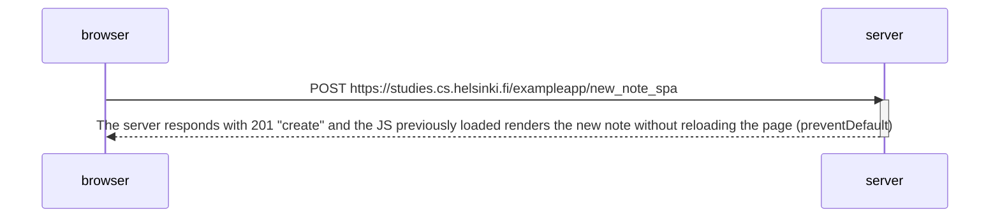

# 0.6

```mermaid
sequenceDiagram
    participant browser
    participant server

    browser->>server: POST https://studies.cs.helsinki.fi/exampleapp/new_note_spa
    activate server
    server-->>browser: The server responds with 201 "create" and the JS previously loaded renders the new note without reloading the page (preventDefault)
    deactivate server
```